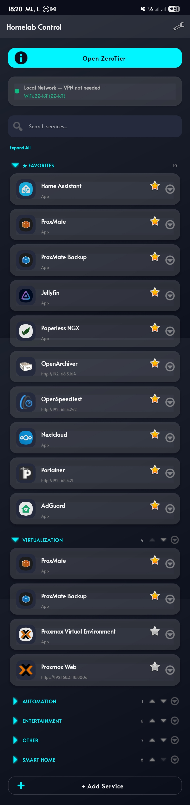
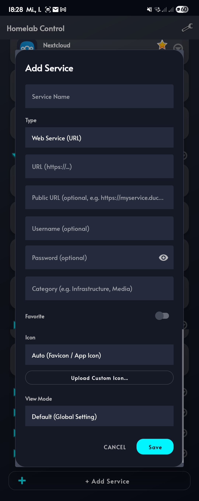
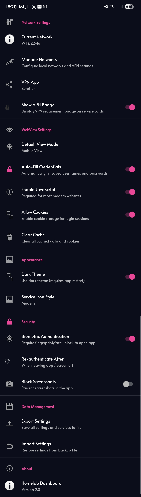

# 🏠 Homelab Dashboard

**Your entire homelab in your pocket.**

A sleek, dark-themed Android app to manage and access all your self-hosted services, VPN connections, and local network infrastructure — right from your phone.

> 🤖 **This app was built entirely by AI** — every line of code, every layout, every feature was generated by [Claude Opus 4.6](https://www.anthropic.com/claude) (Anthropic). No human-written code.

[Download APK](https://github.com/NoPro200/Homelab-Dashboard-App/releases/latest) · [Report Bug](https://github.com/NoPro200/Homelab-Dashboard-App/issues) · [Request Feature](https://github.com/NoPro200/Homelab-Dashboard-App/issues)

---

## 📱 Screenshots

<table>
  <tr>
    <td align="center"><b>Dashboard</b></td>
    <td align="center"><b>Service Management</b></td>
    <td align="center"><b>Settings</b></td>
  </tr>
  <tr>
    <td></td>
    <td></td>
    <td></td>
  </tr>
</table>

---

## ✨ Features

### Service Management
- **Web services & apps** — Add URLs to self-hosted services or pick installed apps from your device
- **Categories** — Organize services into collapsible categories with custom ordering
- **Favorites** — Pin your most-used services to the top with a star
- **Hidden section** — Tuck away services you rarely use without deleting them
- **Search** — Instantly filter across all services, categories, and apps
- **Reorder** — Move services and categories up/down to your liking
- **Bulk actions** — Expand/collapse all categories with one tap

### Icons
- **Auto favicon** — Automatically fetches favicons from your services, even behind self-signed SSL certificates
- **HTML parsing** — Parses `<link rel="icon">` tags when `/favicon.ico` doesn't exist
- **Preset icons** — Choose from built-in icons for popular services (Proxmox, TrueNAS, Portainer, Home Assistant, Grafana, Plex, and more)
- **Custom upload** — Upload your own icon from your gallery
- **Priority system** — Custom → Preset → Auto favicon, with the ability to switch back anytime

### Network Awareness
- **VPN detection** — Real-time VPN status via Android's ConnectivityManager
- **WiFi SSID matching** — Define your home networks by WiFi name; the app shows "Local Network — VPN not needed" when you're home
- **Public URL fallback** — Set a public URL per service (e.g. via DuckDNS/Cloudflare Tunnel); when you're away from home without VPN, the app automatically opens the public URL instead
- **PUBLIC badge** — Visual indicator on service cards showing they're reachable via public URL when not on VPN/local

### Built-in Browser
- **Self-signed SSL** — Auto-accepts certificates for homelab HTTPS services
- **Desktop/Mobile toggle** — Switch user agent per service or globally
- **Auto-fill credentials** — Saved username/password get injected into login forms (supports React/Vue SPA frameworks)
- **File upload & download** — Full support for file chooser dialogs and download manager
- **Geolocation, media playback, external URL handling** — Maximum compatibility with modern web apps

### Security
- **Biometric authentication** — Fingerprint or face unlock to open the app
- **Smart lock timing** — Choose from: always, when leaving app/screen off, or after 1min–1hour of inactivity
- **Rotation-safe** — Screen rotation doesn't trigger re-authentication
- **Device restart** — Always requires authentication after a reboot
- **Secure screenshots** — Optional FLAG_SECURE to prevent screenshots
- **Encrypted storage** — Credentials stored via Android EncryptedSharedPreferences

### Data Management
- **Export** — Save all services, networks, settings, and categories to a JSON file
- **Import** — Restore from backup with a single tap (with overwrite warning)
- **Custom VPN app** — Pick any installed VPN app (ZeroTier, Tailscale, WireGuard, etc.) with a custom display name

---

## 📦 Installation

1. Go to [**Releases**](https://github.com/NoPro200/Homelab-Dashboard-App/releases/latest)
2. Download the latest `homelab-dashboard-vX.X.apk`
3. On your Android device, open the APK and allow installation from unknown sources if prompted
4. Done — the app appears in your app drawer

> **Requires:** Android 8.0 (API 26) or higher

---

## 🚀 Getting Started

1. **Add your services** — Tap the "+ Add Service" button, enter a name and URL
2. **Set up your network** — Go to Settings → Manage Networks → add your home WiFi name (SSID)
3. **Configure VPN** — Go to Settings → VPN App → select your VPN app (ZeroTier, Tailscale, etc.)
4. **Organize** — Assign categories, mark favorites, set icons
5. **Optional: Public URLs** — For services you want to access outside your network, add a public URL in the service edit dialog
6. **Optional: Biometric lock** — Enable in Settings → Security

---

## 🔧 Permissions

| Permission | Why |
|---|---|
| `INTERNET` | Access your services |
| `ACCESS_NETWORK_STATE` | Detect VPN and WiFi status |
| `ACCESS_WIFI_STATE` | Read current WiFi SSID for network matching |
| `ACCESS_FINE_LOCATION` | Required by Android to read WiFi SSID (not used for actual location tracking) |
| `USE_BIOMETRIC` | Fingerprint/face authentication |

---

## 🤝 Contributing

Found a bug or want a feature? Open an [issue](https://github.com/NoPro200/Homelab-Dashboard-App/issues).

---

## 📄 License

This project is licensed under the MIT License — see the [LICENSE](LICENSE) file for details.

---

**Made for homelabbers, by a homelabber — and an AI.** 🤖🖥️

Built entirely by [Claude Opus 4.6](https://www.anthropic.com/claude) · Zero human-written code

